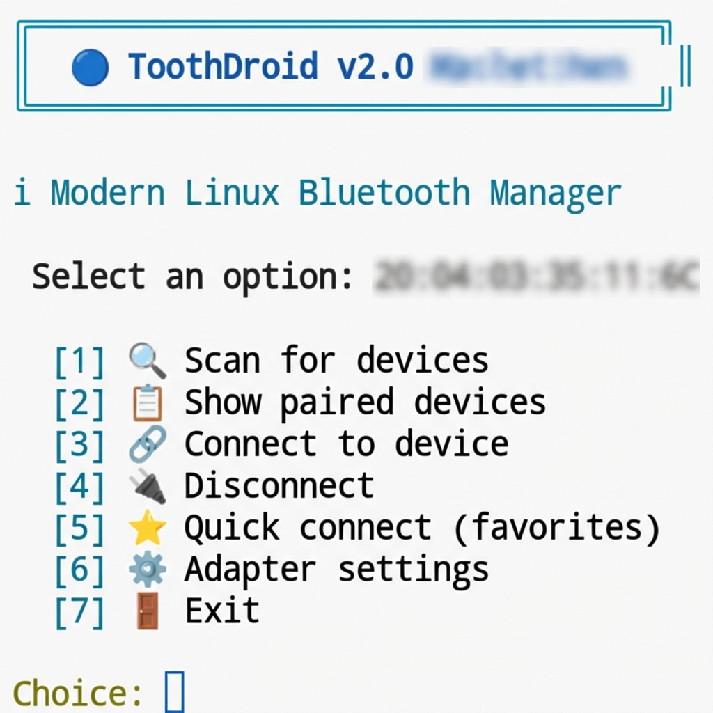

<p align="center">
  
</p>

<h1 align="center">🦷 ToothDroid</h1>

<p align="center">
  <strong>Modern, Mac-style Bluetooth device manager for Linux</strong>
</p>

<p align="center">
  <a href="#features">Features</a> •
  <a href="#ui-showcase">UI Showcase</a> •
  <a href="#installation">Installation</a> •
  <a href="#usage">Usage</a> •
  <a href="#contributing">Contributing</a>
</p>

<p align="center">
  
  
  
  
  
</p>

---

## Why ToothDroid?

Managing Bluetooth on Linux usually means wrestling with terminals or using generic, clunky managers. **ToothDroid** brings a polished, native experience to Linux desktops:

- **Beautiful**: A modern, macOS-inspired interface that looks great.
- **Lightweight**: Built with **Qt6 & C++17** (LGPL). No Electron, no Python, no bloat.
- **Fast**: Native performance with immediate scan results.
- **Intuitive**: Features you need (Connect/Trust/Block), right where you expect them.

---

## Features

### 🖥️ Native Qt6 GUI
- **Mac-Style Controls**: Traffic lights (Red/Yellow/Green) window controls and frameless design.
- **Advanced Context Menu**: Right-click to **Connect**, **Pair**, **Trust**, **Block**, or see **Device Info**.
- **Auto-Scan**: Scans for devices on startup automatically.
- **Responsive**: Clean layout that adapts to window resizing.
- **Visual Feedback**:
  - 🟢 Green = Connected
  - 🔵 Blue = Paired
  - 📡 Detailed signal and profile info

### ⌨️ Powerful CLI
<p align="center">
  
</p>

- **Interactive Menu**: Full control without the GUI if needed.
- **Device Favorites**: Quick access to frequently used headphones/keyboards.
- **Adapter Control**: Manage power, visibility, and unblocking.

---

## Installation

### Prerequisites
| Package | Purpose |
|---------|---------|
| `bluez` | Linux Bluetooth Stack |
| `qt6-base` | GUI Framework |
| `g++` | Compiler (C++17) |
| `make` | Build Tool |

### Quick Start (Arch Linux)
```bash
sudo pacman -S bluez bluez-utils base-devel qt6-base
git clone https://github.com/suaybdemir/bluetooth-connector-linux.git
cd bluetooth-connector-linux
make
./toothdroid-gui
```

### Quick Start (Ubuntu/Debian)
```bash
sudo apt install bluez build-essential qt6-base-dev qt6-base-private-dev
git clone https://github.com/suaybdemir/bluetooth-connector-linux.git
cd bluetooth-connector-linux
make
./toothdroid-gui
```

### Quick Start (Fedora)
```bash
sudo dnf install bluez bluez-tools gcc-c++ make qt6-qtbase-devel
# Then clone and build as above
```

---

## Usage

### 🖱️ GUI Controls
- **Headers**: Drag the window using the top header bar.
- **Actions**:
  - **Left Click**: Connects/Disconnects device.
  - **Right Click**: Opens context menu (Trust, Block, Forget, Info).
- **Controls**: Use the top-left traffic lights to Close, Minimize, or Maximize.
- **Refresh**: Click "Scan" or the refresh icon to find new devices.

### ⌨️ CLI Controls
Run `./toothdroid` and follow the interactive numbers:
1. Scan for devices
2. List paired devices
3. Connect specific device
4. Disconnect
5. Favorites menu
6. Adapter settings

---

## Contributing

We welcome contributions! Please check [CONTRIBUTING.md](CONTRIBUTING.md) for style guides.

### Roadmap 🚀
- [x] Migrate to Qt6 (Completed v2.0)
- [x] Mac-style UI (Completed v2.2)
- [x] Context Menu (Completed v2.3)
- [ ] System Tray Icon
- [ ] Battery Percentage Display
- [ ] Customizable Themes

---

## License

MIT License - see [LICENSE](LICENSE) for details.

<p align="center">
  Made with ❤️ for the Linux community
</p>
