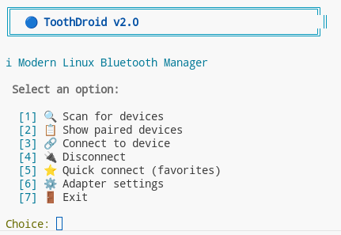

# ToothDroid 🦷

> **A modern, polished Bluetooth Device Manager for Linux.**




ToothDroid is a lightweight, C++ based Bluetooth management utility built with **GTK4** and **gtkmm**. It offers a clean, **macOS-inspired Dark Mode** interface for managing your bluetooth devices with ease.

## ✨ Features

- **Modern UI:** Unifed header bar, rounded corners, and a clean dark theme inspired by macOS Big Sur.
- **Auto-Scan:** Automatically scans for devices on startup.
- **Visual Feedback:** 
  - Green indicators for **Connected** devices.
  - Blue indicators for **Paired** but unconnected devices.
  - Animated progress bar during scanning.
- **Performance:** Native C++ application, extremely lightweight and fast.
- **Convenience:**
  - One-click Connect/Disconnect.
  - Quick Settings access.
  - Thread-safe operations.

## 🚀 Getting Started

### Prerequisites

- Linux (Arch, Fedora, Ubuntu, etc.)
- `gtkmm-4.0`
- `bluez` (via D-Bus)
- `make` & `g++`

### Installation

Clone the repository and build:

```bash
git clone https://github.com/suaybdemir/bluetooth-connector-linux.git
cd bluetooth-connector-linux
make
```

### Usage

Run the GUI:

```bash
make run-gui
```

Or run the CLI version:

```bash
./toothdroid-cli
```

## 🛠️ Built With

- **Language:** C++17
- **GUI Framework:** GTK4 / gtkmm-4.0
- **Communication:** GDBus / BlueZ API

## 📝 License

This project is open source. Feel free to contribute!
